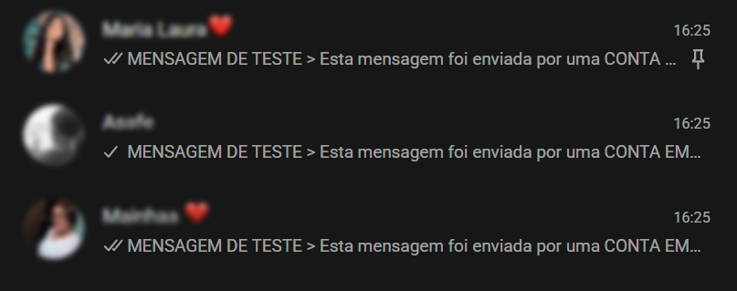

# b2bflow Challenge

Projeto que lê contatos cadastrados no **Supabase** e envia mensagens personalizadas via **Z-API (WhatsApp)**.

---

## ⚙️ Setup da tabela no Supabase

1. Acesse [supabase.com](https://supabase.com) e crie um projeto gratuito.
2. Vá em **SQL Editor** e execute:

```sql
CREATE TABLE contacts (
  id SERIAL PRIMARY KEY,
  name TEXT NOT NULL,
  phone TEXT NOT NULL
);

INSERT INTO contacts (name, phone) VALUES
  ('João', '5511999990001'),
  ('Maria', '5511999990002'),
  ('Carlos', '5511999990003');
```

> O número de telefone deve estar no formato internacional sem `+` e sem espaços. Ex: `5511999990001`

---

## 🔑 Variáveis de ambiente

Copie o arquivo `.env.example` para `.env` e preencha:

```bash
cp .env.example .env
```

| Variável            | Onde encontrar                                                                 |
|---------------------|--------------------------------------------------------------------------------|
| `SUPABASE_URL`      | Painel do projeto → Settings → API → Project URL                              |
| `SUPABASE_KEY`      | Painel do projeto → Settings → API → `anon` public key                        |
| `ZAPI_INSTANCE_ID`  | Painel Z-API → sua instância → ID da instância                                |
| `ZAPI_TOKEN`        | Painel Z-API → sua instância → Token                                          |
| `ZAPI_CLIENT_TOKEN` | Painel Z-API → Account → Security → Client Token                              |

> **Nunca suba o arquivo `.env` para o GitHub.** Ele já está no `.gitignore`.

---

## ▶️ Como rodar

```bash
# 1. Clone o repositório
git clone https://github.com/seu-usuario/b2bflow-challenge.git
cd b2bflow-challenge

# 2. Crie e ative o ambiente virtual
python -m venv .venv
source .venv/bin/activate       # Linux/Mac
.venv\Scripts\activate          # Windows

# 3. Instale as dependências
pip install -r requirements.txt

# 4. Configure o .env
cp .env.example .env
# edite o .env com suas credenciais

# 5. Execute
python main.py
```

### Exemplo de saída esperada

```
2025-01-01 10:00:00 [INFO] 🚀 Iniciando envio de mensagens...
2025-01-01 10:00:01 [INFO] 📋 3 contato(s) encontrado(s).
2025-01-01 10:00:02 [INFO] ✅ Mensagem enviada para João (5511999990001)
2025-01-01 10:00:03 [INFO] ✅ Mensagem enviada para Maria (5511999990002)
2025-01-01 10:00:04 [INFO] ✅ Mensagem enviada para Carlos (5511999990003)
2025-01-01 10:00:04 [INFO] > Envio concluído: 3/3 mensagens enviadas.
```

### Exemplo esperado no WhatsApp


---

## 🗂️ Estrutura do projeto

```
b2bflow-challenge/
├── main.py           # Script principal
├── requirements.txt  # Dependências
├── .env.example      # Template de variáveis de ambiente
├── .gitignore        # Ignora .env e arquivos temporários
└── README.md         # Este arquivo
```
